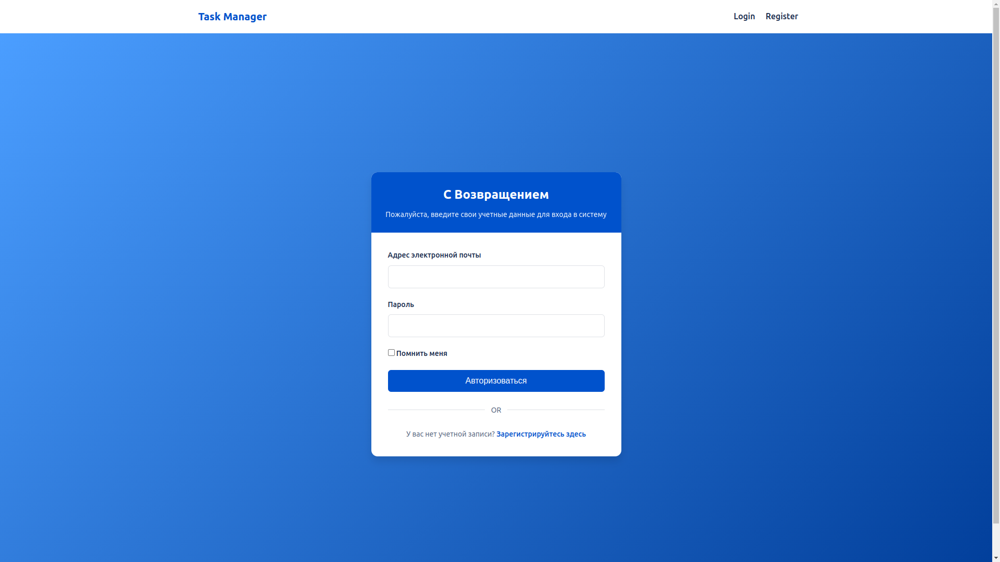
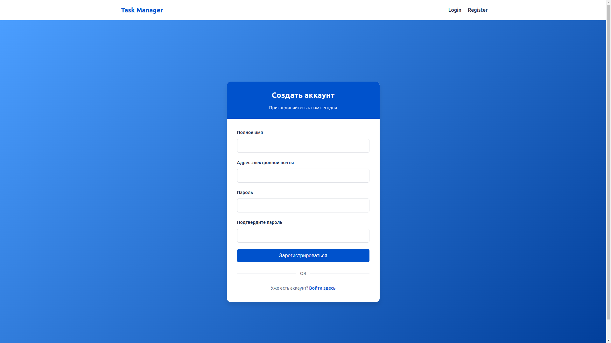
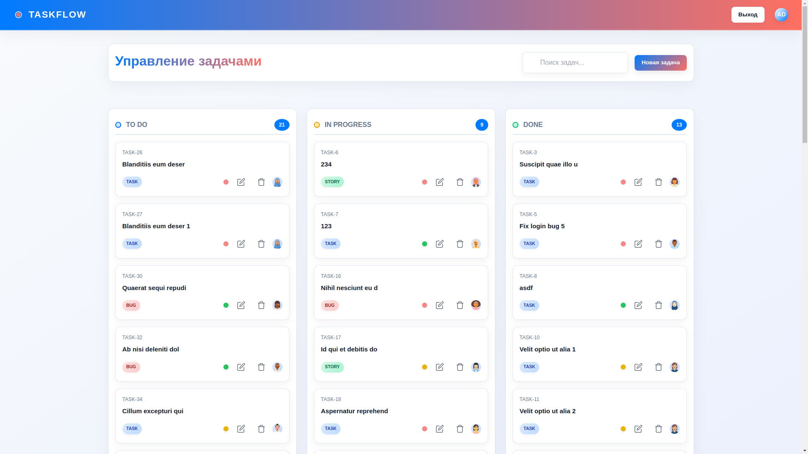
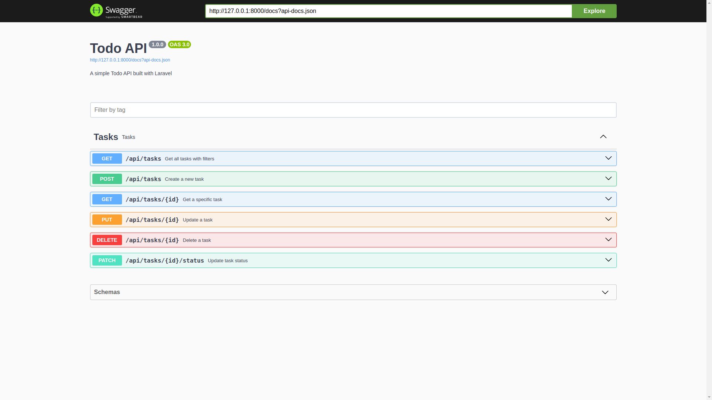

# Task Manager

*Современное приложение для управления задачами с веб-интерфейсом и API*

Task Manager — это стильное и функциональное приложение для управления задачами, вдохновленное Jira. Оно объединяет удобный веб-интерфейс и мощное REST API, чтобы помочь вам организовать работу и повысить продуктивность. Создавайте задачи, управляйте проектами и интегрируйте систему в свои процессы!

---

## ✨ Ключевые особенности

- **Веб-интерфейс**: Чистый, современный и интуитивный дизайн.
- **REST API**: Полноценное API с документацией через Swagger UI.
- **Гибкость**: Подходит как для личных, так и для командных проектов.
- **Адаптивность**: Отлично работает на любых устройствах.
- **Простота**: Быстрая установка и настройка на базе Laravel.

---

## 📸 Скриншоты

### Главная страница веб-интерфейса
  
*Добро пожаловать в Task Manager*

### Вход и регистрация



### Дашборд Главной страницы


### Документация API


### Управление задачами
  
*Создание и отслеживание задач*

### API Документация
  
*Swagger UI для работы с API*

*(Добавьте свои скриншоты в папку `screenshots/` и обновите пути выше, если нужно)*

---
### API
- **Основные эндпоинты**:
    - `GET /api/tasks` — Получить список задач
    - `POST /api/tasks` — Создать новую задачу
    - `PUT /api/tasks/{id}` — Обновить задачу
    - `DELETE /api/tasks/{id}` — Удалить задачу
---
## 🚀 Установка

### Требования
- PHP >= 8.0
- Composer
- Laravel >= 10.x
- MySQL/PostgreSQL (или другая БД)

### Инструкция
1. Склонируйте репозиторий:
   ```bash
   git clone https://github.com/your-username/task-manager.git
   cd task-manager
2. Установите зависимости:
   ```bash
   composer install
   ```
3. Скопируйте файл .env и настройте его:
   ```bash
   cp .env.example .env
   ```
4. Сгенерируйте ключ приложения:
   ```bash
   php artisan key:generate
   ```
5. Выполните миграции и заполните базу данных тестовыми данными:
   ```bash
   php artisan migrate --seed
   ```
6. Запустите сервер:
   ```bash
   php artisan serve
   ```
7. Тестирование:
   ```bash
   php artisan test
   ```
